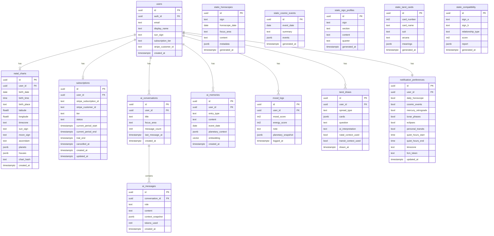

# AstroAI — PostgreSQL Database Schema

> **Last updated:** June 2026
> **Database:** PostgreSQL 16 via Supabase
> **ORM:** SQLAlchemy 2.x (async) — FastAPI backend
> **Extensions required:** `uuid-ossp`, `pgvector`, `pg_trgm`

---

## Table of Contents

1. [Extensions & Conventions](#extensions--conventions)
2. [Schema Diagram (ERD)](#schema-diagram-erd)
3. [Table Definitions](#table-definitions)
   - [users](#1-users)
   - [natal_charts](#2-natal_charts)
   - [static_horoscopes](#3-static_horoscopes)
   - [static_cosmic_events](#4-static_cosmic_events)
   - [static_sign_profiles](#5-static_sign_profiles)
   - [static_tarot_cards](#6-static_tarot_cards)
   - [static_compatibility](#7-static_compatibility)
   - [ai_conversations](#8-ai_conversations)
   - [ai_messages](#9-ai_messages)
   - [ai_memories](#10-ai_memories)
   - [mood_logs](#11-mood_logs)
   - [tarot_draws](#12-tarot_draws)
   - [notification_preferences](#13-notification_preferences)
   - [subscriptions](#14-subscriptions)
   - [content_generation_log](#15-content_generation_log)
4. [Indexes](#indexes)
5. [Row Level Security Policies](#row-level-security-policies)
6. [Static Content Storage Rationale](#static-content-storage-rationale)
7. [pgvector Setup for AI Memory Semantic Search](#pgvector-setup-for-ai-memory-semantic-search)
8. [Migration Strategy from SQLite](#migration-strategy-from-sqlite)

---

## Extensions & Conventions

### Required Extensions

```sql
-- Run once on the Supabase project before creating tables
CREATE EXTENSION IF NOT EXISTS "uuid-ossp";     -- gen_random_uuid()
CREATE EXTENSION IF NOT EXISTS "vector";        -- pgvector for embeddings
CREATE EXTENSION IF NOT EXISTS "pg_trgm";       -- trigram index for text search
```

### Naming Conventions

| Convention | Rule |
|---|---|
| Table names | `snake_case`, plural |
| Column names | `snake_case` |
| Primary keys | Always `id UUID DEFAULT gen_random_uuid()` |
| Foreign keys | `{table_singular}_id UUID` |
| Timestamps | `created_at`, `updated_at` — always `TIMESTAMPTZ` |
| Enums | Defined as PostgreSQL `TYPE` or `text` with CHECK constraints |
| Static tables | Prefixed `static_` — no RLS needed, public read |
| User tables | RLS enabled — user can only read/write their own rows |

### Zodiac Signs Enum

Used across multiple tables. Stored as lowercase `text` with CHECK constraint.

```sql
-- Valid values for any 'sign' column
-- 'aries', 'taurus', 'gemini', 'cancer', 'leo', 'virgo',
-- 'libra', 'scorpio', 'sagittarius', 'capricorn', 'aquarius', 'pisces'
```

---

## Schema Diagram (ERD)

```
┌─────────────────────────────────────────────────────────────────────┐
│  SUPABASE AUTH                                                       │
│  auth.users (managed by Supabase)                                   │
│  id UUID PK                                                         │
└─────────────────────────┬───────────────────────────────────────────┘
                          │ 1:1
                          ▼
┌─────────────────────────────────────┐
│  users                              │
│  PK id UUID                         │
│  FK auth_id → auth.users.id         │
│  email, display_name, sun_sign, ... │
│  stripe_customer_id                 │
└──┬──────────┬───────────┬───────────┘
   │          │           │
   │ 1:1      │ 1:many    │ 1:1
   ▼          ▼           ▼
┌──────────┐ ┌──────────────┐ ┌─────────────────────┐
│natal_    │ │ai_           │ │subscriptions        │
│charts    │ │conversations │ │PK id UUID           │
│PK id     │ │PK id UUID    │ │FK user_id           │
│FK user_id│ │FK user_id    │ │stripe_subscription_id│
│planets   │ └──────┬───────┘ │tier, status         │
│jsonb     │        │ 1:many  └─────────────────────┘
└──────────┘        ▼
            ┌──────────────────┐
            │ai_messages       │
            │PK id UUID        │
            │FK conversation_id│
            │role, content     │
            └──────────────────┘

┌──────────────────────────────────────────────────┐
│  USER DATA TABLES (RLS enabled)                  │
├──────────────┬──────────────┬────────────────────┤
│ ai_memories  │ mood_logs    │ tarot_draws         │
│ PK id UUID   │ PK id UUID   │ PK id UUID          │
│ FK user_id   │ FK user_id   │ FK user_id          │
│ content      │ mood_score   │ cards jsonb         │
│ embedding    │ energy_score │ ai_interpretation   │
│ vector(1536) │ note         │                     │
└──────────────┴──────────────┴────────────────────┘

┌──────────────────────────────────────────────────┐
│  USER PREFERENCES                                │
├──────────────────────────────────────────────────┤
│ notification_preferences   PK id, FK user_id     │
└──────────────────────────────────────────────────┘

┌──────────────────────────────────────────────────┐
│  STATIC CONTENT TABLES (public read, no RLS)     │
├──────────────┬──────────────┬────────────────────┤
│static_       │static_       │static_             │
│horoscopes    │cosmic_events │sign_profiles       │
│sign+date+    │date+summary  │sign+section        │
│focus_area    │              │content jsonb       │
├──────────────┼──────────────┼────────────────────┤
│static_       │static_       │                    │
│tarot_cards   │compatibility │                    │
│78 cards      │144 sign pairs│                    │
│meanings jsonb│report jsonb  │                    │
└──────────────┴──────────────┴────────────────────┘
```

### Mermaid ERD (for rendering in GitHub / docs tools)



---

## Table Definitions

### 1. users

The application-level user record. Mirrors `auth.users` from Supabase Auth but stores app-specific fields. Created automatically via a Supabase trigger when a new auth user signs up.

```sql
CREATE TABLE public.users (
    id                  UUID        PRIMARY KEY DEFAULT gen_random_uuid(),
    auth_id             UUID        NOT NULL UNIQUE REFERENCES auth.users(id) ON DELETE CASCADE,
    email               TEXT        NOT NULL UNIQUE,
    display_name        TEXT,
    avatar_url          TEXT,
    sun_sign            TEXT        CHECK (sun_sign IN (
                                        'aries','taurus','gemini','cancer','leo','virgo',
                                        'libra','scorpio','sagittarius','capricorn','aquarius','pisces'
                                    )),
    birth_date          DATE,                           -- stored here for quick sign lookup, detailed chart in natal_charts
    subscription_tier   TEXT        NOT NULL DEFAULT 'free'
                                    CHECK (subscription_tier IN ('free', 'premium')),
    stripe_customer_id  TEXT        UNIQUE,
    ai_messages_today   INTEGER     NOT NULL DEFAULT 0, -- rate-limit counter, reset nightly
    ai_messages_reset_at TIMESTAMPTZ NOT NULL DEFAULT NOW(),
    onboarding_complete BOOLEAN     NOT NULL DEFAULT FALSE,
    locale              TEXT        NOT NULL DEFAULT 'en',
    created_at          TIMESTAMPTZ NOT NULL DEFAULT NOW(),
    updated_at          TIMESTAMPTZ NOT NULL DEFAULT NOW()
);

-- Auto-update updated_at on row change
CREATE OR REPLACE FUNCTION public.set_updated_at()
RETURNS TRIGGER LANGUAGE plpgsql AS $$
BEGIN
  NEW.updated_at = NOW();
  RETURN NEW;
END;
$$;

CREATE TRIGGER users_updated_at
    BEFORE UPDATE ON public.users
    FOR EACH ROW EXECUTE FUNCTION public.set_updated_at();

-- Auto-create public.users row when Supabase Auth user signs up
CREATE OR REPLACE FUNCTION public.handle_new_auth_user()
RETURNS TRIGGER LANGUAGE plpgsql SECURITY DEFINER AS $$
BEGIN
  INSERT INTO public.users (auth_id, email)
  VALUES (NEW.id, NEW.email)
  ON CONFLICT (auth_id) DO NOTHING;
  RETURN NEW;
END;
$$;

CREATE TRIGGER on_auth_user_created
    AFTER INSERT ON auth.users
    FOR EACH ROW EXECUTE FUNCTION public.handle_new_auth_user();
```

**Design notes:**
- `auth_id` is the Supabase Auth UUID. All RLS policies JOIN on `auth.uid() = users.auth_id`.
- `ai_messages_today` is a lightweight rate-limit counter. Reset by nightly Celery job, not per-request DB write — avoids write contention.
- `sun_sign` is denormalized here for fast horoscope lookup without always joining `natal_charts`.

---

### 2. natal_charts

Stores the computed natal chart for a user. Calculation is done once server-side via `pyswisseph` and persisted — never recalculated on read.

```sql
CREATE TABLE public.natal_charts (
    id                  UUID        PRIMARY KEY DEFAULT gen_random_uuid(),
    user_id             UUID        NOT NULL UNIQUE REFERENCES public.users(id) ON DELETE CASCADE,

    -- Birth data inputs
    birth_date          DATE        NOT NULL,
    birth_time          TIME,                           -- NULL if user selected "unknown time"
    birth_time_known    BOOLEAN     NOT NULL DEFAULT TRUE,
    birth_place         TEXT        NOT NULL,           -- human-readable city/country
    latitude            DOUBLE PRECISION NOT NULL,
    longitude           DOUBLE PRECISION NOT NULL,
    timezone            TEXT        NOT NULL,           -- IANA tz, e.g. "America/New_York"

    -- Computed placements (stored, never recalculated)
    sun_sign            TEXT        NOT NULL,
    moon_sign           TEXT        NOT NULL,
    ascendant           TEXT,                           -- NULL if birth_time unknown
    midheaven           TEXT,                           -- MC, NULL if birth_time unknown

    -- Full planet positions: {"sun": {"sign": "aries", "degree": 14.5, "house": 1}, ...}
    -- Keys: sun, moon, mercury, venus, mars, jupiter, saturn, uranus, neptune, pluto, north_node, chiron
    planets             JSONB       NOT NULL DEFAULT '{}',

    -- House cusps: {"1": {"sign": "aries", "degree": 0.0}, ...} — 12 houses
    -- NULL if birth_time unknown (houses require exact birth time)
    houses              JSONB,

    -- Aspects: [{"planet_a": "sun", "planet_b": "moon", "aspect": "trine", "orb": 2.3}, ...]
    aspects             JSONB       NOT NULL DEFAULT '[]',

    -- AI-generated deep interpretation (Claude Sonnet, generated once)
    ai_interpretation   TEXT,
    interpretation_generated_at TIMESTAMPTZ,

    -- Hash of inputs used to detect if recalculation is needed
    chart_hash          TEXT        NOT NULL,

    created_at          TIMESTAMPTZ NOT NULL DEFAULT NOW(),
    updated_at          TIMESTAMPTZ NOT NULL DEFAULT NOW()
);

CREATE TRIGGER natal_charts_updated_at
    BEFORE UPDATE ON public.natal_charts
    FOR EACH ROW EXECUTE FUNCTION public.set_updated_at();
```

**Design notes:**
- `planets` JSONB structure: `{"sun": {"sign": "aries", "degree": 14.52, "house": 1, "retrograde": false}, ...}`. Stored as JSONB for flexibility — new bodies can be added without schema migration.
- `chart_hash` is `sha256(birth_date || birth_time || latitude || longitude)`. If a user corrects their birth data, hash changes, triggering re-calculation and re-generation of `ai_interpretation`.
- One chart per user (`UNIQUE` on `user_id`). Updates in-place when birth data is corrected.

---

### 3. static_horoscopes

Pre-generated daily horoscope content, keyed by `sign + horoscope_date + focus_area`. Generated nightly by Celery batch job using Gemini Flash — 72 rows per day (12 signs × 6 focus areas).

```sql
CREATE TYPE horoscope_focus_area AS ENUM (
    'overall', 'love', 'career', 'wealth', 'wellness', 'guidance', 'motivation'
);

CREATE TABLE public.static_horoscopes (
    id                  UUID        PRIMARY KEY DEFAULT gen_random_uuid(),
    sign                TEXT        NOT NULL CHECK (sign IN (
                                        'aries','taurus','gemini','cancer','leo','virgo',
                                        'libra','scorpio','sagittarius','capricorn','aquarius','pisces'
                                    )),
    horoscope_date      DATE        NOT NULL,
    focus_area          horoscope_focus_area NOT NULL,

    -- Main horoscope text (typically 100–200 words)
    content             TEXT        NOT NULL,

    -- Structured extras — lucky number, energy color, key theme, power time
    metadata            JSONB       NOT NULL DEFAULT '{}',
    -- e.g.: {"lucky_number": 7, "energy_color": "gold", "key_theme": "communication",
    --        "power_time": "afternoon", "intensity_score": 4}

    -- Which planetary transits were active when this was generated
    -- (for transparency + future personalization layer)
    transit_context     JSONB       NOT NULL DEFAULT '[]',
    -- e.g.: [{"planet": "mars", "aspect": "trine", "natal_planet": null, "transit_sign": "leo"}]

    -- Prompt version used to generate this content (for A/B testing and quality tracking)
    prompt_version      TEXT        NOT NULL DEFAULT 'horoscope_v1',

    generated_at        TIMESTAMPTZ NOT NULL DEFAULT NOW(),
    generation_model    TEXT        NOT NULL DEFAULT 'gemini-2.0-flash',

    CONSTRAINT uq_static_horoscopes_sign_date_focus
        UNIQUE (sign, horoscope_date, focus_area)
);
```

**Query pattern:**
```sql
-- App fetches horoscope — O(1) lookup via composite index
SELECT content, metadata
FROM static_horoscopes
WHERE sign = 'aries'
  AND horoscope_date = CURRENT_DATE
  AND focus_area = 'love';
```

---

### 4. static_cosmic_events

Pre-generated daily planetary highlights — one row per day describing what's happening cosmically for everyone. Includes lunar phases, retrogrades, ingresses, and notable aspects. Absorbs the existing `lunar_events`, `planetary_retrogrades`, and `planetary_ingresses` SQLite tables.

```sql
CREATE TABLE public.static_cosmic_events (
    id                  UUID        PRIMARY KEY DEFAULT gen_random_uuid(),
    event_date          DATE        NOT NULL UNIQUE,

    -- Human-readable daily summary (AI-generated, ~150 words)
    summary             TEXT        NOT NULL,

    -- Structured event list for rendering in the app UI
    events              JSONB       NOT NULL DEFAULT '[]',
    -- e.g.: [
    --   {"type": "lunar_phase", "name": "Full Moon", "sign": "scorpio",
    --    "exact_time": "14:32 UTC", "description": "..."},
    --   {"type": "retrograde_start", "planet": "mercury", "sign": "virgo",
    --    "description": "..."},
    --   {"type": "ingress", "planet": "venus", "from_sign": "leo", "to_sign": "virgo",
    --    "exact_time": "09:15 UTC", "description": "..."},
    --   {"type": "aspect", "planet_a": "sun", "aspect": "trine", "planet_b": "jupiter",
    --    "description": "..."}
    -- ]

    -- Raw ephemeris positions for all planets at noon UTC (for transit calculations)
    planetary_positions JSONB       NOT NULL DEFAULT '{}',
    -- e.g.: {"sun": {"sign": "gemini", "degree": 10.5}, "moon": {...}, ...}

    -- Intensity score 1–5 (how significant is today cosmically)
    intensity_score     SMALLINT    CHECK (intensity_score BETWEEN 1 AND 5),

    prompt_version      TEXT        NOT NULL DEFAULT 'cosmic_events_v1',
    generated_at        TIMESTAMPTZ NOT NULL DEFAULT NOW(),
    generation_model    TEXT        NOT NULL DEFAULT 'gemini-2.0-flash'
);
```

**Migration note:** The existing SQLite `lunar_events`, `planetary_retrogrades`, and `planetary_ingresses` tables map into the `events` JSONB array in this table. Raw ephemeris data continues to be computed via `pyswisseph` locally and stored here as structured JSON.

---

### 5. static_sign_profiles

Zodiac archetype profiles and yearly overviews — generated quarterly (4×/year). One row per sign per section per quarter. Serves the "Zodiac Sign Insights" feature without any real-time AI call.

```sql
CREATE TYPE sign_profile_section AS ENUM (
    'archetype',            -- who this sign is (personality, traits, strengths, shadows)
    'yearly_overview',      -- current year theme and overview
    'monthly_breakdown',    -- 12-month breakdown for the current year
    'element_modality',     -- element (fire/earth/air/water) and modality (cardinal/fixed/mutable)
    'compatibility_summary',-- quick compatibility overview for this sign
    'famous_people'         -- notable people with this sun sign
);

CREATE TABLE public.static_sign_profiles (
    id                  UUID        PRIMARY KEY DEFAULT gen_random_uuid(),
    sign                TEXT        NOT NULL CHECK (sign IN (
                                        'aries','taurus','gemini','cancer','leo','virgo',
                                        'libra','scorpio','sagittarius','capricorn','aquarius','pisces'
                                    )),
    section             sign_profile_section NOT NULL,

    -- The year and quarter this was generated for (e.g., '2026', 'Q3')
    -- Allows multiple versions — app always serves the latest
    year                SMALLINT    NOT NULL,
    quarter             CHAR(2)     NOT NULL CHECK (quarter IN ('Q1','Q2','Q3','Q4')),

    -- Primary content text
    content             TEXT        NOT NULL,

    -- Structured data alongside prose (for UI rendering)
    structured_data     JSONB       NOT NULL DEFAULT '{}',
    -- For 'archetype': {"keywords": ["ambitious","determined"], "element": "earth",
    --                   "modality": "cardinal", "ruling_planet": "saturn",
    --                   "symbol": "sea-goat", "house": "10th"}
    -- For 'monthly_breakdown': {"months": [{"month": "January", "theme": "...", "focus": "career"}, ...]}

    prompt_version      TEXT        NOT NULL DEFAULT 'sign_profile_v1',
    generated_at        TIMESTAMPTZ NOT NULL DEFAULT NOW(),
    generation_model    TEXT        NOT NULL DEFAULT 'gemini-2.0-flash',

    CONSTRAINT uq_sign_profiles_sign_section_quarter
        UNIQUE (sign, section, year, quarter)
);
```

**Query pattern:**
```sql
-- Fetch current archetype for Aries — latest quarter
SELECT content, structured_data
FROM static_sign_profiles
WHERE sign = 'aries'
  AND section = 'archetype'
  AND year = EXTRACT(YEAR FROM CURRENT_DATE)::smallint
ORDER BY quarter DESC
LIMIT 1;
```

---

### 6. static_tarot_cards

All 78 tarot cards with pre-generated meanings — generated once, refreshed only when content quality is improved. Serves the Tarot Hub without any real-time AI call for card meanings.

```sql
CREATE TABLE public.static_tarot_cards (
    id                  UUID        PRIMARY KEY DEFAULT gen_random_uuid(),
    card_number         SMALLINT    NOT NULL UNIQUE CHECK (card_number BETWEEN 0 AND 77),
    card_name           TEXT        NOT NULL UNIQUE,
    arcana              TEXT        NOT NULL CHECK (arcana IN ('major', 'minor')),
    suit                TEXT        CHECK (suit IN ('wands','cups','swords','pentacles', NULL)),
    -- NULL for Major Arcana

    -- Structured meanings object
    meanings            JSONB       NOT NULL DEFAULT '{}',
    -- {
    --   "keywords_upright": ["new beginnings", "opportunity"],
    --   "keywords_reversed": ["false starts", "delays"],
    --   "upright": "...",          -- 100-word upright meaning
    --   "reversed": "...",         -- 100-word reversed meaning
    --   "love": "...",             -- love-specific meaning
    --   "career": "...",           -- career-specific meaning
    --   "spiritual": "...",        -- spiritual/growth meaning
    --   "yes_no": "yes",           -- "yes", "no", or "maybe"
    --   "numerology": 1,           -- numeric value
    --   "astrology_association": "aries",
    --   "element": "fire",
    --   "image_url": "https://r2.astroai.app/tarot/the-fool.webp"
    -- }

    -- Astrological associations
    astrology_sign      TEXT,
    astrology_planet    TEXT,
    element             TEXT        CHECK (element IN ('fire','earth','air','water', NULL)),

    prompt_version      TEXT        NOT NULL DEFAULT 'tarot_v1',
    generated_at        TIMESTAMPTZ NOT NULL DEFAULT NOW(),
    generation_model    TEXT        NOT NULL DEFAULT 'gemini-2.0-flash'
);

-- Seed data: card numbers 0–21 are Major Arcana, 22–77 are Minor Arcana
-- (Populated by initial migration script — see migration section)
```

---

### 7. static_compatibility

Pre-generated compatibility reports for all 144 sign-pair × relationship-type combinations. Generated once and refreshed quarterly. Serves the Compatibility feature for generic sign-based reports.

Note: The 144 = 12 × 12 combinations include same-sign pairs. The `(sign_a, sign_b)` pair is normalized — `sign_a` is always alphabetically earlier than `sign_b` to avoid storing duplicates.

```sql
CREATE TYPE relationship_type AS ENUM (
    'love', 'friendship', 'family', 'business', 'general'
);

CREATE TABLE public.static_compatibility (
    id                  UUID        PRIMARY KEY DEFAULT gen_random_uuid(),
    sign_a              TEXT        NOT NULL CHECK (sign_a IN (
                                        'aries','taurus','gemini','cancer','leo','virgo',
                                        'libra','scorpio','sagittarius','capricorn','aquarius','pisces'
                                    )),
    sign_b              TEXT        NOT NULL CHECK (sign_b IN (
                                        'aries','taurus','gemini','cancer','leo','virgo',
                                        'libra','scorpio','sagittarius','capricorn','aquarius','pisces'
                                    )),
    relationship_type   relationship_type NOT NULL,

    -- Compatibility score 0–100
    score               SMALLINT    NOT NULL CHECK (score BETWEEN 0 AND 100),

    -- Full report
    report              JSONB       NOT NULL DEFAULT '{}',
    -- {
    --   "summary": "...",          -- 80-word overview
    --   "strengths": ["...", "..."],   -- 2 strengths
    --   "watch_outs": ["...", "..."],  -- 2 challenges
    --   "chemistry_type": "magnetic",  -- "magnetic", "steady", "challenging", "complementary"
    --   "long_term_potential": "high", -- "high", "medium", "low"
    --   "famous_pairs": [{"person_a": "Taylor Swift", "sign_a": "sagittarius",
    --                     "person_b": "Travis Kelce", "sign_b": "scorpio"}]
    -- }

    year                SMALLINT    NOT NULL,   -- for quarterly refresh tracking
    quarter             CHAR(2)     NOT NULL CHECK (quarter IN ('Q1','Q2','Q3','Q4')),

    prompt_version      TEXT        NOT NULL DEFAULT 'compatibility_v1',
    generated_at        TIMESTAMPTZ NOT NULL DEFAULT NOW(),
    generation_model    TEXT        NOT NULL DEFAULT 'gemini-2.0-flash',

    CONSTRAINT uq_compatibility_signs_type_quarter
        UNIQUE (sign_a, sign_b, relationship_type, year, quarter),
    -- Enforce alphabetical ordering of sign pair to prevent duplicate entries
    CONSTRAINT chk_compatibility_sign_order
        CHECK (sign_a <= sign_b)
);
```

**Query pattern:**
```sql
-- Always normalize the pair before querying
SELECT score, report
FROM static_compatibility
WHERE sign_a = LEAST('scorpio', 'aries')
  AND sign_b = GREATEST('scorpio', 'aries')
  AND relationship_type = 'love'
  AND year = EXTRACT(YEAR FROM CURRENT_DATE)::smallint
ORDER BY quarter DESC
LIMIT 1;
```

---

### 8. ai_conversations

Container for a user's AI Astrologer conversation threads. Each conversation has a topic/context and groups related messages.

```sql
CREATE TABLE public.ai_conversations (
    id                  UUID        PRIMARY KEY DEFAULT gen_random_uuid(),
    user_id             UUID        NOT NULL REFERENCES public.users(id) ON DELETE CASCADE,

    -- Auto-generated or user-set title
    title               TEXT,

    -- What was the primary focus of this conversation
    focus_area          TEXT        CHECK (focus_area IN (
                                        'general', 'love', 'career', 'wealth',
                                        'wellness', 'guidance', 'natal_chart', 'transit'
                                    )),

    -- Denormalized for fast display (avoids COUNT query on ai_messages)
    message_count       INTEGER     NOT NULL DEFAULT 0,

    -- Snapshot of natal context used in this conversation
    natal_chart_id      UUID        REFERENCES public.natal_charts(id) ON DELETE SET NULL,

    -- Whether this conversation used the memory layer
    memory_enabled      BOOLEAN     NOT NULL DEFAULT TRUE,

    last_message_at     TIMESTAMPTZ,
    created_at          TIMESTAMPTZ NOT NULL DEFAULT NOW()
);
```

---

### 9. ai_messages

Individual messages within an AI Astrologer conversation. Stored for conversation history, context window management, and future memory synthesis.

```sql
CREATE TABLE public.ai_messages (
    id                  UUID        PRIMARY KEY DEFAULT gen_random_uuid(),
    conversation_id     UUID        NOT NULL REFERENCES public.ai_conversations(id) ON DELETE CASCADE,
    user_id             UUID        NOT NULL REFERENCES public.users(id) ON DELETE CASCADE,
    -- Denormalized for efficient RLS policy evaluation and direct user queries

    role                TEXT        NOT NULL CHECK (role IN ('user', 'assistant', 'system')),
    content             TEXT        NOT NULL,

    -- Snapshot of the context that was injected into this AI call
    -- Stored for debugging, quality review, and A/B testing
    context_snapshot    JSONB       NOT NULL DEFAULT '{}',
    -- {
    --   "natal_placements": {"sun": "aries", ...},
    --   "active_transits": [...],
    --   "memories_retrieved": [...],   -- ai_memory IDs surfaced for this message
    --   "mood_summary": "...",
    --   "prompt_version": "assistant_v2"
    -- }

    -- Token accounting
    tokens_input        INTEGER,
    tokens_output       INTEGER,
    model_used          TEXT        NOT NULL DEFAULT 'claude-sonnet-4-5',

    created_at          TIMESTAMPTZ NOT NULL DEFAULT NOW()
);
```

---

### 10. ai_memories

The memory layer — user-reported life events, feelings, and decisions that the AI Astrologer uses for longitudinal personalization. Each entry gets a pgvector embedding for semantic search.

```sql
CREATE TYPE memory_entry_type AS ENUM (
    'event',        -- something that happened ("I got a job offer")
    'feeling',      -- an emotional state ("I've been feeling anxious lately")
    'decision',     -- a choice the user made ("I decided to end the relationship")
    'outcome',      -- follow-up to a previous event ("The interview went well")
    'insight',      -- AI-generated synthesis (written by system, not user)
    'pattern'       -- AI-identified recurring pattern (written by system)
);

CREATE TABLE public.ai_memories (
    id                  UUID        PRIMARY KEY DEFAULT gen_random_uuid(),
    user_id             UUID        NOT NULL REFERENCES public.users(id) ON DELETE CASCADE,

    entry_type          memory_entry_type NOT NULL,
    content             TEXT        NOT NULL,           -- what the user said or the AI noted

    -- When the event occurred (user-reported, may differ from created_at)
    event_date          DATE,

    -- Tags for filtering (e.g., ["relationship", "career", "anxiety"])
    tags                TEXT[]      NOT NULL DEFAULT '{}',

    -- Planetary positions active at event_date (computed from pyswisseph, stored for retrospective analysis)
    planetary_context   JSONB       NOT NULL DEFAULT '{}',
    -- {"sun_sign": "gemini", "moon_sign": "scorpio",
    --  "transits": [{"planet": "saturn", "aspect": "square", "natal_planet": "moon"}]}

    -- Source: how was this memory created?
    source              TEXT        NOT NULL DEFAULT 'user_reported'
                                    CHECK (source IN ('user_reported', 'ai_extracted', 'ai_synthesized')),

    -- pgvector embedding (1536 dims — text-embedding-3-small or equivalent)
    -- Used for semantic similarity search when building context for AI calls
    embedding           vector(1536),

    -- Whether this memory is active or has been superseded/resolved
    is_active           BOOLEAN     NOT NULL DEFAULT TRUE,

    -- Link to the conversation message this was extracted from (if applicable)
    source_message_id   UUID        REFERENCES public.ai_messages(id) ON DELETE SET NULL,

    created_at          TIMESTAMPTZ NOT NULL DEFAULT NOW(),
    updated_at          TIMESTAMPTZ NOT NULL DEFAULT NOW()
);

CREATE TRIGGER ai_memories_updated_at
    BEFORE UPDATE ON public.ai_memories
    FOR EACH ROW EXECUTE FUNCTION public.set_updated_at();
```

---

### 11. mood_logs

Daily mood and energy check-ins. Stored with a planetary snapshot for later correlation analysis (AI-powered weekly digest connecting moods to transits).

```sql
CREATE TABLE public.mood_logs (
    id                  UUID        PRIMARY KEY DEFAULT gen_random_uuid(),
    user_id             UUID        NOT NULL REFERENCES public.users(id) ON DELETE CASCADE,

    -- 1–5 scale (1 = very low, 5 = excellent)
    mood_score          SMALLINT    NOT NULL CHECK (mood_score BETWEEN 1 AND 5),
    energy_score        SMALLINT    NOT NULL CHECK (energy_score BETWEEN 1 AND 5),

    -- Optional free-text note
    note                TEXT,

    -- Current planetary positions at time of log — computed from pyswisseph, stored for correlation
    planetary_snapshot  JSONB       NOT NULL DEFAULT '{}',
    -- {"sun": {"sign": "gemini", "degree": 10.5}, "moon": {...},
    --  "active_transits": [{"planet": "mars", "aspect": "square", "natal": "moon"}]}

    -- Emotion tags selected by user (optional multi-select)
    emotions            TEXT[]      NOT NULL DEFAULT '{}',
    -- e.g.: ["anxious", "hopeful", "tired", "creative"]

    logged_at           TIMESTAMPTZ NOT NULL DEFAULT NOW()
);
```

---

### 12. tarot_draws

Records of user tarot draws, including AI-generated fusion interpretations that combine card meanings with the user's natal chart and current transits.

```sql
CREATE TYPE tarot_spread_type AS ENUM (
    'daily',            -- single card draw
    'three_card',       -- past/present/future or situation/action/outcome
    'celtic_cross',     -- 10-card spread (premium only)
    'relationship',     -- relationship-focused spread (premium only)
    'career',           -- career-focused spread (premium only)
    'oracle'            -- free-form question
);

CREATE TABLE public.tarot_draws (
    id                  UUID        PRIMARY KEY DEFAULT gen_random_uuid(),
    user_id             UUID        NOT NULL REFERENCES public.users(id) ON DELETE CASCADE,

    spread_type         tarot_spread_type NOT NULL,

    -- Cards drawn: [{"card_id": "uuid", "card_name": "The Fool", "position": "past", "reversed": false}]
    cards               JSONB       NOT NULL DEFAULT '[]',

    -- User's question (optional)
    question            TEXT,

    -- AI-generated interpretation (Gemini Flash fusion of card + natal + transits)
    ai_interpretation   TEXT,

    -- Context flags for transparency
    natal_context_used  BOOLEAN     NOT NULL DEFAULT FALSE,
    transit_context_used BOOLEAN    NOT NULL DEFAULT FALSE,

    -- Planetary snapshot at draw time (for retrospective analysis)
    planetary_snapshot  JSONB       NOT NULL DEFAULT '{}',

    -- User reflection added after the reading
    reflection          TEXT,

    -- Saved to Tarot Journal by user
    is_saved            BOOLEAN     NOT NULL DEFAULT FALSE,

    model_used          TEXT,
    tokens_used         INTEGER,

    drawn_at            TIMESTAMPTZ NOT NULL DEFAULT NOW()
);
```

---

### 13. notification_preferences

Per-user notification settings and FCM token for Firebase Cloud Messaging.

```sql
CREATE TABLE public.notification_preferences (
    id                      UUID        PRIMARY KEY DEFAULT gen_random_uuid(),
    user_id                 UUID        NOT NULL UNIQUE REFERENCES public.users(id) ON DELETE CASCADE,

    -- Notification type toggles
    daily_horoscope         BOOLEAN     NOT NULL DEFAULT TRUE,
    cosmic_events           BOOLEAN     NOT NULL DEFAULT TRUE,
    mercury_retrograde      BOOLEAN     NOT NULL DEFAULT TRUE,
    lunar_phases            BOOLEAN     NOT NULL DEFAULT TRUE,
    eclipses                BOOLEAN     NOT NULL DEFAULT TRUE,
    personal_transits       BOOLEAN     NOT NULL DEFAULT FALSE,  -- premium only
    mood_reminder           BOOLEAN     NOT NULL DEFAULT FALSE,
    weekly_digest           BOOLEAN     NOT NULL DEFAULT TRUE,

    -- Quiet hours (user's local time)
    quiet_hours_start       TIME,                                -- e.g., '22:00'
    quiet_hours_end         TIME,                                -- e.g., '08:00'
    timezone                TEXT        NOT NULL DEFAULT 'UTC',

    -- Firebase Cloud Messaging token (refreshed by client)
    fcm_token               TEXT,
    fcm_token_updated_at    TIMESTAMPTZ,

    -- Preferred notification time for daily horoscope (user's local time)
    daily_horoscope_time    TIME        NOT NULL DEFAULT '07:00',

    updated_at              TIMESTAMPTZ NOT NULL DEFAULT NOW()
);

CREATE TRIGGER notification_preferences_updated_at
    BEFORE UPDATE ON public.notification_preferences
    FOR EACH ROW EXECUTE FUNCTION public.set_updated_at();
```

---

### 14. subscriptions

Stripe subscription state mirror. The source of truth is always Stripe — this table is kept in sync via Stripe webhooks.

```sql
CREATE TYPE subscription_tier AS ENUM ('free', 'premium');
CREATE TYPE subscription_status AS ENUM (
    'active', 'trialing', 'past_due', 'canceled', 'unpaid', 'incomplete', 'paused'
);

CREATE TABLE public.subscriptions (
    id                      UUID        PRIMARY KEY DEFAULT gen_random_uuid(),
    user_id                 UUID        NOT NULL UNIQUE REFERENCES public.users(id) ON DELETE CASCADE,

    -- Stripe identifiers
    stripe_subscription_id  TEXT        UNIQUE,                 -- sub_xxxx
    stripe_customer_id      TEXT        NOT NULL,               -- cus_xxxx
    stripe_price_id         TEXT,                               -- price_xxxx (monthly or annual)

    tier                    subscription_tier NOT NULL DEFAULT 'free',
    status                  subscription_status NOT NULL DEFAULT 'active',

    -- Billing period
    current_period_start    TIMESTAMPTZ,
    current_period_end      TIMESTAMPTZ,

    -- Trial
    trial_start             TIMESTAMPTZ,
    trial_end               TIMESTAMPTZ,

    -- Cancellation
    cancel_at_period_end    BOOLEAN     NOT NULL DEFAULT FALSE,
    cancelled_at            TIMESTAMPTZ,

    -- The raw Stripe event payload — stored for debugging / audit
    latest_webhook_event    JSONB,

    created_at              TIMESTAMPTZ NOT NULL DEFAULT NOW(),
    updated_at              TIMESTAMPTZ NOT NULL DEFAULT NOW()
);

CREATE TRIGGER subscriptions_updated_at
    BEFORE UPDATE ON public.subscriptions
    FOR EACH ROW EXECUTE FUNCTION public.set_updated_at();
```

**Stripe webhook handler** (FastAPI) updates this table on the following events:
- `customer.subscription.created`
- `customer.subscription.updated`
- `customer.subscription.deleted`
- `invoice.payment_failed`
- `customer.subscription.trial_will_end`

After updating `subscriptions`, the handler also updates `users.subscription_tier` to keep the denormalized field consistent.

---

### 15. content_generation_log

Audit table tracking every batch content generation run. Used for monitoring, debugging missing content, and cost tracking.

```sql
CREATE TABLE public.content_generation_log (
    id                  UUID        PRIMARY KEY DEFAULT gen_random_uuid(),
    job_type            TEXT        NOT NULL,
    -- 'daily_horoscopes', 'cosmic_events', 'sign_profiles', 'tarot_cards', 'compatibility'

    target_date         DATE,                   -- for date-specific jobs
    target_sign         TEXT,                   -- for sign-specific jobs
    target_quarter      TEXT,                   -- for quarterly jobs

    status              TEXT        NOT NULL CHECK (status IN ('pending', 'running', 'success', 'failed')),
    rows_generated      INTEGER     NOT NULL DEFAULT 0,
    error_message       TEXT,

    -- Cost tracking
    tokens_input        INTEGER,
    tokens_output       INTEGER,
    estimated_cost_usd  NUMERIC(10, 6),
    model_used          TEXT,
    prompt_version      TEXT,

    started_at          TIMESTAMPTZ NOT NULL DEFAULT NOW(),
    completed_at        TIMESTAMPTZ
);
```

---

## Indexes

### Primary Lookup Indexes

```sql
-- users
CREATE UNIQUE INDEX idx_users_auth_id ON public.users (auth_id);
CREATE UNIQUE INDEX idx_users_email ON public.users (email);
CREATE INDEX idx_users_subscription_tier ON public.users (subscription_tier)
    WHERE subscription_tier = 'premium';  -- partial index — only index paying users

-- natal_charts
CREATE UNIQUE INDEX idx_natal_charts_user_id ON public.natal_charts (user_id);
-- Enables JSON path queries on natal chart placements
CREATE INDEX idx_natal_charts_planets ON public.natal_charts USING gin (planets);

-- subscriptions
CREATE UNIQUE INDEX idx_subscriptions_stripe_id ON public.subscriptions (stripe_subscription_id)
    WHERE stripe_subscription_id IS NOT NULL;
CREATE INDEX idx_subscriptions_status ON public.subscriptions (status, current_period_end)
    WHERE status IN ('active', 'trialing');
```

### Static Content — Core Query Indexes

```sql
-- static_horoscopes: primary read pattern is (sign, date, focus_area)
-- The UNIQUE constraint already creates this index:
-- UNIQUE (sign, horoscope_date, focus_area) → btree index
-- Additional covering index for SELECT content, metadata (avoids heap fetch)
CREATE INDEX idx_static_horoscopes_covering
    ON public.static_horoscopes (sign, horoscope_date, focus_area)
    INCLUDE (content, metadata);

-- static_cosmic_events: lookup is always by date
-- The UNIQUE constraint on event_date handles this.

-- static_sign_profiles: lookup by sign + section + recency
CREATE INDEX idx_sign_profiles_sign_section_year
    ON public.static_sign_profiles (sign, section, year DESC, quarter DESC);

-- static_compatibility: lookup always by normalized sign pair + type
-- UNIQUE constraint covers this. Additional index for sign-only lookups
-- (e.g., "show all compatibility for aries")
CREATE INDEX idx_compatibility_sign_a ON public.static_compatibility (sign_a, relationship_type);
CREATE INDEX idx_compatibility_sign_b ON public.static_compatibility (sign_b, relationship_type);
```

### User Data — Foreign Key and Time-Series Indexes

```sql
-- ai_conversations: user's conversation list, sorted by recency
CREATE INDEX idx_ai_conversations_user_id_last_message
    ON public.ai_conversations (user_id, last_message_at DESC);

-- ai_messages: fetch all messages in a conversation, in order
CREATE INDEX idx_ai_messages_conversation_id_created
    ON public.ai_messages (conversation_id, created_at ASC);
-- Also index user_id for RLS policy evaluation
CREATE INDEX idx_ai_messages_user_id ON public.ai_messages (user_id);

-- ai_memories: user's memory list, filtered by type and recency
CREATE INDEX idx_ai_memories_user_id_active
    ON public.ai_memories (user_id, is_active, created_at DESC)
    WHERE is_active = TRUE;
CREATE INDEX idx_ai_memories_user_id_type
    ON public.ai_memories (user_id, entry_type, event_date DESC);
-- GIN index for tag array filtering
CREATE INDEX idx_ai_memories_tags ON public.ai_memories USING gin (tags);

-- mood_logs: user's mood history, always fetched as time-series
CREATE INDEX idx_mood_logs_user_id_logged_at
    ON public.mood_logs (user_id, logged_at DESC);

-- tarot_draws: user's draw history + saved draws filter
CREATE INDEX idx_tarot_draws_user_id_drawn_at
    ON public.tarot_draws (user_id, drawn_at DESC);
CREATE INDEX idx_tarot_draws_user_id_saved
    ON public.tarot_draws (user_id, is_saved)
    WHERE is_saved = TRUE;  -- partial index for journal queries

-- notification_preferences: FCM dispatch — find users by timezone and preference
CREATE INDEX idx_notification_prefs_timezone_daily
    ON public.notification_preferences (timezone, daily_horoscope_time)
    WHERE daily_horoscope = TRUE AND fcm_token IS NOT NULL;
```

### pgvector Index for Semantic Memory Search

```sql
-- HNSW index on ai_memories.embedding
-- HNSW is preferred over IVFFlat for Supabase/pgvector because:
--   - No training step required (IVFFlat needs CREATE INDEX with nlist parameter after data load)
--   - Better recall at query time (HNSW: ~99% recall vs IVFFlat: ~95%)
--   - Faster build time for moderate dataset sizes (<10M rows)
--   - Supabase recommends HNSW for most use cases
CREATE INDEX idx_ai_memories_embedding_hnsw
    ON public.ai_memories
    USING hnsw (embedding vector_cosine_ops)
    WITH (m = 16, ef_construction = 64);
-- m = 16: number of bi-directional links per node (higher = better recall, more memory)
-- ef_construction = 64: size of dynamic candidate list during build (higher = better quality, slower build)
-- These are the Supabase-recommended defaults. Tune upward (m=32, ef_construction=128)
-- when the memories table grows past ~500K rows per user cohort.
```

### Full-Text Search Indexes

```sql
-- Full-text search on ai_memories content (for user's own memory search UI)
CREATE INDEX idx_ai_memories_content_fts
    ON public.ai_memories
    USING gin (to_tsvector('english', content));

-- Trigram index on tarot card names (for fuzzy search in card picker UI)
CREATE INDEX idx_tarot_cards_name_trgm
    ON public.static_tarot_cards
    USING gin (card_name gin_trgm_ops);
```

---

## Row Level Security Policies

All user-data tables have RLS enabled. Static content tables do not — they are public read.

### Enable RLS

```sql
ALTER TABLE public.users                   ENABLE ROW LEVEL SECURITY;
ALTER TABLE public.natal_charts            ENABLE ROW LEVEL SECURITY;
ALTER TABLE public.ai_conversations        ENABLE ROW LEVEL SECURITY;
ALTER TABLE public.ai_messages             ENABLE ROW LEVEL SECURITY;
ALTER TABLE public.ai_memories             ENABLE ROW LEVEL SECURITY;
ALTER TABLE public.mood_logs               ENABLE ROW LEVEL SECURITY;
ALTER TABLE public.tarot_draws             ENABLE ROW LEVEL SECURITY;
ALTER TABLE public.notification_preferences ENABLE ROW LEVEL SECURITY;
ALTER TABLE public.subscriptions           ENABLE ROW LEVEL SECURITY;

-- Static tables: NO RLS — public read, backend-only write
-- static_horoscopes, static_cosmic_events, static_sign_profiles,
-- static_tarot_cards, static_compatibility, content_generation_log
```

### Helper Function

```sql
-- Returns the public.users.id for the currently authenticated Supabase user.
-- Used in all RLS policies to avoid repeating the auth → user JOIN.
CREATE OR REPLACE FUNCTION public.current_user_id()
RETURNS UUID LANGUAGE sql STABLE SECURITY DEFINER AS $$
    SELECT id FROM public.users WHERE auth_id = auth.uid()
$$;
```

### users

```sql
-- Users can only read and update their own row.
-- INSERT is handled by the trigger on auth.users — not exposed via RLS.
CREATE POLICY users_select_own ON public.users
    FOR SELECT USING (auth_id = auth.uid());

CREATE POLICY users_update_own ON public.users
    FOR UPDATE USING (auth_id = auth.uid())
    WITH CHECK (auth_id = auth.uid());

-- Service role (backend) can do anything — bypasses RLS
-- (Supabase service_role key is used by FastAPI backend)
```

### natal_charts

```sql
CREATE POLICY natal_charts_select_own ON public.natal_charts
    FOR SELECT USING (user_id = public.current_user_id());

CREATE POLICY natal_charts_insert_own ON public.natal_charts
    FOR INSERT WITH CHECK (user_id = public.current_user_id());

CREATE POLICY natal_charts_update_own ON public.natal_charts
    FOR UPDATE USING (user_id = public.current_user_id())
    WITH CHECK (user_id = public.current_user_id());

CREATE POLICY natal_charts_delete_own ON public.natal_charts
    FOR DELETE USING (user_id = public.current_user_id());
```

### ai_conversations

```sql
CREATE POLICY ai_conversations_select_own ON public.ai_conversations
    FOR SELECT USING (user_id = public.current_user_id());

CREATE POLICY ai_conversations_insert_own ON public.ai_conversations
    FOR INSERT WITH CHECK (user_id = public.current_user_id());

CREATE POLICY ai_conversations_update_own ON public.ai_conversations
    FOR UPDATE USING (user_id = public.current_user_id())
    WITH CHECK (user_id = public.current_user_id());

CREATE POLICY ai_conversations_delete_own ON public.ai_conversations
    FOR DELETE USING (user_id = public.current_user_id());
```

### ai_messages

```sql
-- Messages are accessed via conversation — user can only see messages
-- in conversations they own. The user_id denormalization makes this efficient.
CREATE POLICY ai_messages_select_own ON public.ai_messages
    FOR SELECT USING (user_id = public.current_user_id());

CREATE POLICY ai_messages_insert_own ON public.ai_messages
    FOR INSERT WITH CHECK (user_id = public.current_user_id());

-- No UPDATE or DELETE on messages — conversation history is immutable.
-- Deletion cascades from ai_conversations delete.
```

### ai_memories

```sql
CREATE POLICY ai_memories_select_own ON public.ai_memories
    FOR SELECT USING (user_id = public.current_user_id());

CREATE POLICY ai_memories_insert_own ON public.ai_memories
    FOR INSERT WITH CHECK (user_id = public.current_user_id());

CREATE POLICY ai_memories_update_own ON public.ai_memories
    FOR UPDATE USING (user_id = public.current_user_id())
    WITH CHECK (user_id = public.current_user_id());

CREATE POLICY ai_memories_delete_own ON public.ai_memories
    FOR DELETE USING (user_id = public.current_user_id());
```

### mood_logs

```sql
CREATE POLICY mood_logs_select_own ON public.mood_logs
    FOR SELECT USING (user_id = public.current_user_id());

CREATE POLICY mood_logs_insert_own ON public.mood_logs
    FOR INSERT WITH CHECK (user_id = public.current_user_id());

CREATE POLICY mood_logs_update_own ON public.mood_logs
    FOR UPDATE USING (user_id = public.current_user_id())
    WITH CHECK (user_id = public.current_user_id());

CREATE POLICY mood_logs_delete_own ON public.mood_logs
    FOR DELETE USING (user_id = public.current_user_id());
```

### tarot_draws

```sql
CREATE POLICY tarot_draws_select_own ON public.tarot_draws
    FOR SELECT USING (user_id = public.current_user_id());

CREATE POLICY tarot_draws_insert_own ON public.tarot_draws
    FOR INSERT WITH CHECK (user_id = public.current_user_id());

CREATE POLICY tarot_draws_update_own ON public.tarot_draws
    FOR UPDATE USING (user_id = public.current_user_id())
    WITH CHECK (user_id = public.current_user_id());

CREATE POLICY tarot_draws_delete_own ON public.tarot_draws
    FOR DELETE USING (user_id = public.current_user_id());
```

### notification_preferences

```sql
CREATE POLICY notification_prefs_select_own ON public.notification_preferences
    FOR SELECT USING (user_id = public.current_user_id());

CREATE POLICY notification_prefs_insert_own ON public.notification_preferences
    FOR INSERT WITH CHECK (user_id = public.current_user_id());

CREATE POLICY notification_prefs_update_own ON public.notification_preferences
    FOR UPDATE USING (user_id = public.current_user_id())
    WITH CHECK (user_id = public.current_user_id());
```

### subscriptions

```sql
-- Users can read their own subscription but NOT modify it directly.
-- All writes go through the FastAPI service role (Stripe webhook handler).
CREATE POLICY subscriptions_select_own ON public.subscriptions
    FOR SELECT USING (user_id = public.current_user_id());

-- No INSERT/UPDATE/DELETE policies for anon/authenticated role.
-- The Supabase service_role key (used in FastAPI backend) bypasses RLS for writes.
```

### Supabase Realtime — Selective Enable

```sql
-- Enable Realtime only on tables where live updates matter (e.g., conversation streaming)
ALTER PUBLICATION supabase_realtime ADD TABLE public.ai_messages;
ALTER PUBLICATION supabase_realtime ADD TABLE public.ai_conversations;
-- Do NOT enable Realtime on static tables — no value, wastes WAL bandwidth
```

---

## Static Content Storage Rationale

### The Core Cost Principle

The fundamental design decision: **anything that can be keyed by public data (sign, date, card number, sign pair) is pre-generated and stored as static content**. Real-time AI calls are reserved exclusively for interactions that require individual user context and cannot be pre-computed.

### Static Content Key Design

| Table | Natural Key | Query Pattern | Freshness |
|---|---|---|---|
| `static_horoscopes` | `(sign, date, focus_area)` | `WHERE sign = ? AND horoscope_date = CURRENT_DATE AND focus_area = ?` | Nightly |
| `static_cosmic_events` | `(date)` | `WHERE event_date = CURRENT_DATE` | Nightly |
| `static_sign_profiles` | `(sign, section, year, quarter)` | `WHERE sign = ? AND section = ? ORDER BY year DESC, quarter DESC LIMIT 1` | Quarterly |
| `static_tarot_cards` | `(card_number)` | `WHERE card_number = ?` | Once (refresh when content improves) |
| `static_compatibility` | `(sign_a, sign_b, type, year, quarter)` | `WHERE sign_a = LEAST(a,b) AND sign_b = GREATEST(a,b) AND type = ?` | Quarterly |

### Why PostgreSQL Instead of Redis-Only for Static Content

Static content is stored in PostgreSQL (not just Redis) because:
1. **Persistence** — Redis TTL eviction would require re-generation on cold cache. DB is the source of truth.
2. **Historical access** — users can request yesterday's or last week's horoscope. DB keeps history; Redis doesn't.
3. **Audit trail** — `content_generation_log` tracks every generation run for cost accounting.
4. **Fallback** — if Redis is unavailable, the API falls back to PostgreSQL directly.

Redis sits **in front of** PostgreSQL as a cache layer:
```
Request → Redis hit (TTL: 24h) → return immediately
        ↘ Redis miss → PostgreSQL query → populate Redis → return
```

### Daily Batch Generation Counts

```
Daily batch job generates:
  static_horoscopes:    12 signs × 7 focus_areas = 84 rows/day
  static_cosmic_events: 1 row/day

Quarterly batch generates:
  static_sign_profiles:   12 signs × 6 sections = 72 rows/quarter
  static_compatibility:   66 unique pairs × 5 types = 330 rows/quarter
                          (66 = 12×12/2 + 12/2 for same-sign pairs)

One-time generation:
  static_tarot_cards: 78 rows (refresh when content strategy changes)
```

---

## pgvector Setup for AI Memory Semantic Search

### Why Semantic Search on Memories

When the AI Astrologer receives a user message (e.g., *"I'm nervous about this job interview tomorrow"*), the system needs to surface relevant past memories to inject into the context window. A SQL `LIKE` query on keywords is inadequate — the user might have previously said *"I felt the same anxiety before my promotion last year"* without using the word "interview." Semantic search via pgvector finds conceptually similar memories regardless of exact wording.

### Embedding Model

```
Model: text-embedding-3-small (OpenAI) — 1536 dimensions
Cost: $0.020 per 1M tokens — negligible
Alternative: Gemini text-embedding-004 (768 dims) — use vector(768) if preferred

Each memory entry is embedded when created/updated.
Embedding is generated in the FastAPI background task after INSERT.
```

### Index Choice: HNSW vs IVFFlat

| | HNSW | IVFFlat |
|---|---|---|
| Build | No training required | Requires data pre-load + `nlist` tuning |
| Recall | ~99% | ~95% (tunable) |
| Insert speed | Slower (updates index on every INSERT) | Faster (batch-buildable) |
| Query speed | Fast at any scale | Fast but degrades without periodic VACUUM |
| Memory | Higher | Lower |
| **Verdict** | **Use for AstroAI** | Use only if >10M rows |

```sql
-- Already defined above, repeated here for clarity:
CREATE INDEX idx_ai_memories_embedding_hnsw
    ON public.ai_memories
    USING hnsw (embedding vector_cosine_ops)
    WITH (m = 16, ef_construction = 64);
```

### Semantic Search Query Example

```sql
-- Retrieve the 5 most semantically relevant active memories for a user,
-- given an embedding of the user's current message.
-- Called by FastAPI before building the AI Astrologer context window.

SELECT
    id,
    content,
    entry_type,
    event_date,
    tags,
    planetary_context,
    1 - (embedding <=> $1::vector) AS similarity_score
FROM public.ai_memories
WHERE
    user_id = $2
    AND is_active = TRUE
    AND embedding IS NOT NULL
ORDER BY embedding <=> $1::vector  -- cosine distance (lower = more similar)
LIMIT 5;

-- $1 = embedding vector of the current user message (float[1536])
-- $2 = user UUID
-- <=> operator = cosine distance (requires vector_cosine_ops index)
```

### SQLAlchemy Model (pgvector)

```python
# backend/database/models.py
from pgvector.sqlalchemy import Vector
from sqlalchemy import Column, Text, Date, Boolean, ARRAY
from sqlalchemy.dialects.postgresql import UUID, JSONB, TIMESTAMP

class AIMemory(Base):
    __tablename__ = "ai_memories"

    id              = Column(UUID(as_uuid=True), primary_key=True, default=uuid4)
    user_id         = Column(UUID(as_uuid=True), ForeignKey("users.id"), nullable=False)
    entry_type      = Column(Text, nullable=False)
    content         = Column(Text, nullable=False)
    event_date      = Column(Date)
    tags            = Column(ARRAY(Text), nullable=False, default=list)
    planetary_context = Column(JSONB, nullable=False, default=dict)
    source          = Column(Text, nullable=False, default="user_reported")
    embedding       = Column(Vector(1536))   # pgvector type
    is_active       = Column(Boolean, nullable=False, default=True)
    source_message_id = Column(UUID(as_uuid=True), ForeignKey("ai_messages.id"), nullable=True)
    created_at      = Column(TIMESTAMP(timezone=True), nullable=False, default=func.now())
    updated_at      = Column(TIMESTAMP(timezone=True), nullable=False, default=func.now())
```

### Embedding Generation Flow

```
User sends message to AI Astrologer
  ↓
FastAPI endpoint receives message
  ↓
1. Embed user message: embedding = embed(message_content)
2. Query ai_memories for top-5 semantic matches (query above)
3. Build context window: natal_chart + retrieved_memories + active_transits
4. Send to Claude Sonnet with full context
5. Store ai_message (user) + ai_message (assistant)
  ↓
Background task (after response sent):
6. If message contains self-reported event/feeling → extract memory
7. Embed new memory: embedding = embed(memory_content)
8. INSERT into ai_memories with embedding
```

---

## Migration Strategy from SQLite

### Current SQLite Schema

The existing SQLite database (`planetary_notification_data.sqlite3`) contains three tables:

| SQLite Table | Rows | Migration Target |
|---|---|---|
| `lunar_events` | ~50/year | `static_cosmic_events.events` JSONB array |
| `planetary_retrogrades` | ~20/year | `static_cosmic_events.events` JSONB array |
| `planetary_ingresses` | ~100/year | `static_cosmic_events.events` JSONB array |

These three tables are merged into `static_cosmic_events` — one row per day with all events for that day in the `events` JSONB array.

### Migration Script

```python
# scripts/migrate_sqlite_to_postgres.py
import sqlite3
import json
from collections import defaultdict
from datetime import date
import psycopg2

SQLITE_PATH = "backend/database/planetary_notification_data.sqlite3"
POSTGRES_DSN = "postgresql://..."  # from env

def migrate():
    sqlite_conn = sqlite3.connect(SQLITE_PATH)
    pg_conn = psycopg2.connect(POSTGRES_DSN)

    # Group SQLite events by date
    events_by_date = defaultdict(list)

    # Lunar events — create one record per start date and one per end date
    for row in sqlite_conn.execute("SELECT event, start, end, duration_days FROM lunar_events"):
        event_name, start, end, duration = row
        for d in [start, end]:
            if d:
                events_by_date[d[:10]].append({
                    "type": "lunar_phase",
                    "name": event_name,
                    "start": start,
                    "end": end,
                    "duration_days": duration,
                    "description": ""  # to be filled by AI generation
                })

    # Planetary retrogrades
    for row in sqlite_conn.execute("SELECT planet, start, end, duration_days FROM planetary_retrogrades"):
        planet, start, end, duration = row
        for d, event_type in [(start, "retrograde_start"), (end, "retrograde_end")]:
            if d:
                events_by_date[d[:10]].append({
                    "type": event_type,
                    "planet": planet,
                    "start": start,
                    "end": end,
                    "duration_days": duration,
                    "description": ""
                })

    # Planetary ingresses
    for row in sqlite_conn.execute("SELECT planet, time, sign, sign_number FROM planetary_ingresses"):
        planet, time_str, sign, sign_number = row
        d = time_str[:10]
        events_by_date[d].append({
            "type": "ingress",
            "planet": planet,
            "to_sign": sign,
            "sign_number": sign_number,
            "exact_time": time_str,
            "description": ""
        })

    # Insert into PostgreSQL static_cosmic_events
    pg_cur = pg_conn.cursor()
    for event_date_str, events in events_by_date.items():
        pg_cur.execute("""
            INSERT INTO public.static_cosmic_events
                (event_date, summary, events, planetary_positions)
            VALUES (%s, %s, %s::jsonb, '{}'::jsonb)
            ON CONFLICT (event_date) DO UPDATE SET
                events = EXCLUDED.events
        """, (
            event_date_str,
            f"Planetary events for {event_date_str}",  # placeholder — replace with AI generation
            json.dumps(events)
        ))

    pg_conn.commit()
    print(f"Migrated events for {len(events_by_date)} dates")
    sqlite_conn.close()
    pg_conn.close()

if __name__ == "__main__":
    migrate()
```

### Phase-by-Phase Migration Plan

#### Phase 0 — Pre-migration (Do Before Any Schema Changes)

```bash
# 1. Dump current SQLite data for backup
sqlite3 backend/database/planetary_notification_data.sqlite3 .dump > backup_$(date +%Y%m%d).sql

# 2. Provision Supabase project
# 3. Run: CREATE EXTENSION IF NOT EXISTS "uuid-ossp";
# 4. Run: CREATE EXTENSION IF NOT EXISTS "vector";
# 5. Run: CREATE EXTENSION IF NOT EXISTS "pg_trgm";
```

#### Phase 1 — Foundation Tables

Deploy in this order (respects FK dependencies):

```
1. public.users                   (depends on: auth.users)
2. public.natal_charts             (depends on: users)
3. public.subscriptions            (depends on: users)
4. public.notification_preferences (depends on: users)
5. public.static_horoscopes
6. public.static_cosmic_events
7. public.static_sign_profiles
8. public.static_tarot_cards
9. public.static_compatibility
10. public.content_generation_log
```

Run migration script to populate `static_cosmic_events` from SQLite.

#### Phase 2 — AI and User Data Tables

```
11. public.ai_conversations        (depends on: users, natal_charts)
12. public.ai_messages             (depends on: ai_conversations, users)
13. public.ai_memories             (depends on: users, ai_messages)
14. public.mood_logs               (depends on: users)
15. public.tarot_draws             (depends on: users)
```

#### Phase 3 — Enable All RLS Policies

Enable RLS only after all tables are created and tested. Enable with `service_role` key to avoid locking out the migration scripts.

```sql
-- Enable RLS on all user tables (run after Phase 2 tables are created)
-- Use service_role connection to ensure admin access during migration
ALTER TABLE public.users ENABLE ROW LEVEL SECURITY;
-- ... (all tables listed in RLS section above)
```

#### Phase 4 — Backfill Static Content

```bash
# Run batch generation jobs to populate static content tables
# These are idempotent — safe to re-run
celery -A backend.worker call tasks.generate_static_horoscopes --args='["2026-06-01"]'
celery -A backend.worker call tasks.generate_cosmic_events --args='["2026-06-01"]'
celery -A backend.worker call tasks.generate_sign_profiles --args='["Q3", 2026]'
celery -A backend.worker call tasks.generate_tarot_meanings
celery -A backend.worker call tasks.generate_compatibility_reports --args='["Q3", 2026]'
```

#### Phase 5 — Validation

```sql
-- Verify row counts after migration
SELECT 'static_horoscopes' AS table_name, COUNT(*) FROM static_horoscopes
UNION ALL SELECT 'static_cosmic_events', COUNT(*) FROM static_cosmic_events
UNION ALL SELECT 'static_tarot_cards', COUNT(*) FROM static_tarot_cards
UNION ALL SELECT 'static_compatibility', COUNT(*) FROM static_compatibility
UNION ALL SELECT 'static_sign_profiles', COUNT(*) FROM static_sign_profiles;

-- Verify no missing horoscopes for today
SELECT sign, focus_area
FROM (
    SELECT unnest(ARRAY['aries','taurus','gemini','cancer','leo','virgo',
                         'libra','scorpio','sagittarius','capricorn','aquarius','pisces']) AS sign,
           unnest(ARRAY['overall','love','career','wealth','wellness','guidance','motivation']::text[]) AS focus_area
) AS expected
EXCEPT
SELECT sign, focus_area
FROM static_horoscopes
WHERE horoscope_date = CURRENT_DATE;
-- Should return 0 rows

-- Verify tarot card count
SELECT COUNT(*) FROM static_tarot_cards;  -- should be 78

-- Verify compatibility coverage
SELECT COUNT(*) FROM static_compatibility
WHERE year = EXTRACT(YEAR FROM CURRENT_DATE)::smallint;  -- should be 330
```

### SQLAlchemy Alembic Setup

```python
# alembic/env.py — configure for async SQLAlchemy + Supabase
from alembic import context
from sqlalchemy.ext.asyncio import create_async_engine
from backend.database.models import Base

DATABASE_URL = os.environ["SUPABASE_DATABASE_URL"]
# Format: postgresql+asyncpg://postgres:[password]@[host]:5432/postgres

def run_migrations_online():
    connectable = create_async_engine(DATABASE_URL)
    # ... standard async Alembic setup
```

All schema changes after initial deployment go through Alembic migrations — never `ALTER TABLE` directly in production. Migration files live in `backend/alembic/versions/`.

---

*End of DATABASE_SCHEMA.md*
