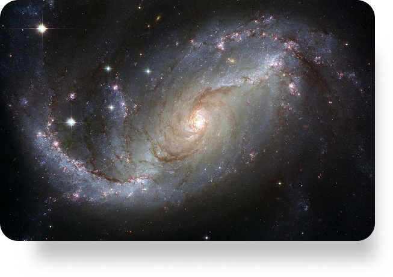

# AstroAI - Your Personal Cosmic Guide 🌌

A modern Flutter web application that combines traditional astrology with AI technology to provide personalized cosmic guidance and immersive astrological experiences.



## ✨ Features

### 🎯 Core Experience
- **Personalized Horoscopes** - Daily insights for all zodiac signs
- **Compatibility Analysis** - Deep relationship and friendship insights
- **Natal Chart Reading** - Professional-grade birth chart analysis
- **AI-Powered Guidance** - Smart cosmic advice tailored to you
- **Celebrity Compatibility** - Compare your chart with famous personalities

### 💫 Interactive UI
- Responsive design that works beautifully on all devices
- Smooth scrolling navigation with animated transitions
- Interactive zodiac section with detailed sign information
- Modern, space-themed aesthetic with premium visuals
- Intuitive user flows for astrological insights

### 🔮 Smart Features
- Real-time planetary positions and transit tracking
- Customizable notification system for cosmic events
- Comprehensive compatibility reports
- Integration with timezone data for accurate chart calculations
- Review system for astrological events and predictions

## 🛠️ Technical Stack

### Frontend (Flutter Web)
- Modern, responsive UI built with Flutter
- Custom animations and transitions
- State management using StatefulWidget
- Google Fonts integration (Inter)
- Optimized asset loading and caching

### Backend (Python)
- FastAPI for high-performance API endpoints
- Swiss Ephemeris for precise astronomical calculations
- SQLite database for user data and notifications
- Google's Gemini AI for personalized interpretations
- Timezone handling for accurate birth chart calculations

## � Project Structure

```
lib/
├── main.dart              # App entry point and main UI components
├── pages.dart            # Route definitions and page components
├── models/               # Data models and state management
└── widgets/             # Reusable UI components
```

## 🚀 Getting Started

1. **Prerequisites**
   - Flutter SDK (latest stable version)
   - Dart SDK
   - VS Code with Flutter extensions

2. **Installation**
   ```bash
   # Clone the repository
   git clone https://github.com/sailing-together/AstroAI.git

   # Navigate to the project directory
   cd AstroAI/test

   # Get dependencies
   flutter pub get

   # Run the web app
   flutter run -d chrome
   ```

## 🎨 Design System

### Colors
- Primary: Deep Space Black (#000000)
- Secondary: Cosmic White (#FFFFFF)
- Accent: Star Silver (#DADADA)
- Text: Dynamic opacity blacks and whites

### Typography
- Primary Font: Inter
- Weights: Regular (400), Medium (500), Bold (700)
- Responsive sizing system

## 🤝 Contributing

We welcome contributions! Please read our contributing guidelines before submitting pull requests.

## 📄 License

This project is licensed under the MIT License - see the LICENSE file for details.

---

Built with 💫 by the AstroAI Team
  - Heart: `#F9C3C3` (pink)
  - Toolbox: `#BAE9AB` (green) 
  - Flask: `#EAF1B2` (yellow)
  - Dollar: `#3E5F8D` (blue)
- **Feature Cards**: `#4A4A4A`, `#9398DF`, `#BB8075`, `#6953B9`

### Typography
- **Headlines**: Cinzel (50px, bold) - for major titles
- **Body Text**: Raleway (16px) - for descriptions  
- **UI Elements**: Inter (12px, bold) - for buttons and labels

### Layout
- **Max Width**: 1400px centered containers
- **Responsive Breakpoints**: 800px (mobile), 600px (compact)
- **Spacing**: Consistent 24px gaps, 16px padding

## 🔧 Setup & Installation

### Prerequisites
- Flutter SDK (3.8.0+)
- Dart SDK
- Web browser with Flutter web support

### Installation Steps

1. **Clone the repository**
   ```bash
   git clone [repository-url]
   cd test
   ```

2. **Install dependencies**
   ```bash
   flutter pub get
   ```

3. **Run the development server**
   ```bash
   flutter run -d chrome --web-port 3001
   ```

4. **Access the application**
   - Open browser to `http://localhost:3001`
   - Or use the development preview at `http://localhost:48752`

## 📋 Project Sections

### 1. Navigation Header
- Logo with circular icon
- Menu items: Home, Horoscope, More Features, About Us
- CTA button: "Reach out to us"
- Responsive mobile hamburger menu

### 2. Hero Section - "Explore Your Journey"
- Cosmic-themed headline with Cinzel typography
- Descriptive subtitle about AI-powered astrology
- "Learn more" call-to-action button
- Featured space imagery with shadow effects

### 3. Zodiac Selection Grid
- 12 interactive zodiac cards (Aries through Pisces)
- Hover animations with 3D flip effects
- Card details: symbol, name, date ranges
- Gradient backgrounds with custom shadows

### 4. "Unlock Your Cosmic Destiny"
- 2x2 grid of feature icons with custom SVG graphics
- Heart (relationships), Toolbox (career), Flask (science), Dollar (finance)
- Detailed descriptions of AI analysis capabilities
- "Enter your birthday" action button

### 5. Features Showcase
- Horizontal card layout: Matching, Natal Chart, ASMR, Tarot
- Circular colored icons positioned above cards
- "learn more" links with underlined styling
- Bottom CTA button for engagement

## 🧭 Navigation Pages

### Horoscope Page
- **Daily Cosmic Insights** with four main categories
- Clean card-based layout for easy reading
- Consistent typography and spacing

### About Us Page  
- **Complete project overview** from ABOUT.md
- **Vision statement** and AI integration details
- **Feature grid** highlighting core capabilities
- **Premium features** section with ASMR details

### Contact Page
- **Professional contact interface**
- **Email support**: support@astroai.com
- **Partnership inquiries**: partners@astroai.com
- Clean card design with proper hierarchy

## 🎯 Recent Updates

### v1.0 Latest Improvements
- ✅ **Width Consistency**: All sections now use 1400px max-width
- ✅ **Interactive Navigation**: Clickable menu items with page routing
- ✅ **Hover Animations**: Zodiac cards with 3D flip effects
- ✅ **Custom Icons**: SVG-based feature graphics matching Figma design
- ✅ **Responsive Design**: Optimized for all screen sizes
- ✅ **Page Navigation**: Complete About, Horoscope, and Contact pages

### Animation Features
- **Zodiac Card Flips**: 300ms smooth transitions with easing curves
- **Hover States**: MouseRegion detection for web interactions
- **3D Transforms**: Matrix4 rotations for realistic card flipping
- **Custom Painters**: Wave patterns and decorative elements

## 📊 Performance

- **Responsive Design**: Fluid layouts for 320px to 1440px+ screens
- **Optimized Assets**: Compressed images and efficient SVG graphics
- **Smooth Animations**: 60fps transitions with proper animation controllers
- **Fast Navigation**: Instant page transitions with Flutter routing

## 🔮 Future Roadmap

- Advanced AI integration for personalized predictions
- Extended meditation library with more zodiac experiences  
- Enhanced social features for community interaction
- International language support for global users
- Voice-activated features for hands-free interaction

## 📝 Development Notes

### Key Implementation Details
- **AnimationController**: Used for zodiac card flip animations
- **CustomPainter**: Created for feature icons and decorative elements
- **LayoutBuilder**: Responsive design with conditional layouts
- **Navigator.push**: Page routing for multi-page navigation
- **Google Fonts**: Typography consistency across all components

### Code Organization
- **Component-based architecture** with reusable widgets
- **Consistent naming conventions** for maintainability  
- **Responsive utilities** with MediaQuery breakpoints
- **Clean separation** between UI and navigation logic

---

## 📄 License

This project is part of the AstroAI cosmic guidance platform. For detailed technical specifications and implementation guides, visit our [development roadmap](https://roadmap.sh/r/astro-web-design).

**Built with Flutter 💙 for a cosmic experience 🌟**
